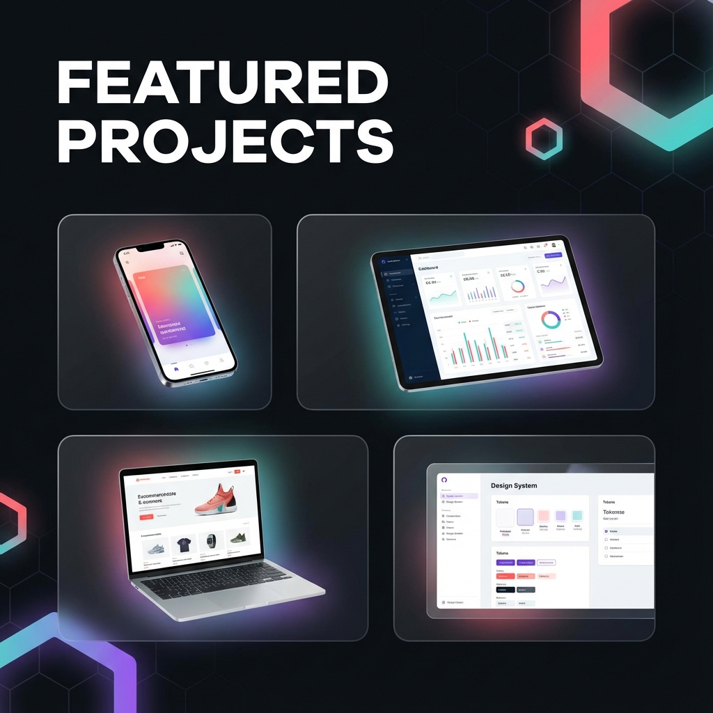
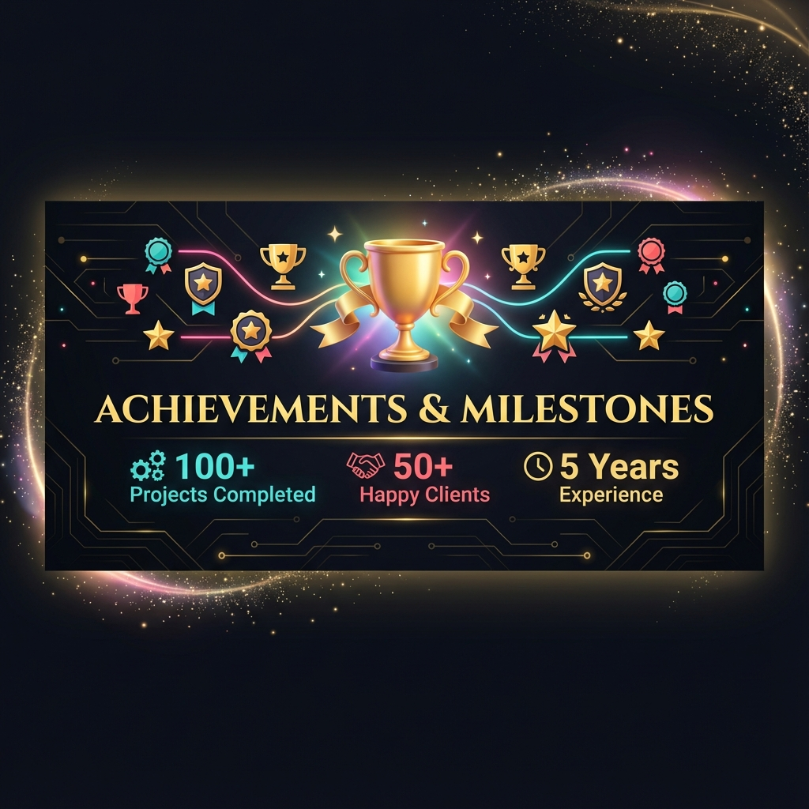

<div align="center">

<!-- Dynamic Typing Header -->


</div>

<!-- Animated Snake -->
<div align="center">
  
</div>

---

<div align="center">

### 🎨 Transforming Ideas into Stunning Digital Experiences

**UX/UI Designer • Visual Designer • Full Stack Developer • Product Designer**


</div>

<!-- Social Badges with Animation -->
<div align="center">
  
[](https://portfolio.baselora.com/)
[](YOUR_LINKEDIN_URL)
[](YOUR_BEHANCE_URL)
[](YOUR_DRIBBBLE_URL)
[](mailto:YOUR_EMAIL)

</div>


<!-- About Me Section with Cards -->
<div align="center">

## 🚀 About Me

<table>
<tr>
<td>

```yaml
name: Sagar Navnath
located_in: India
current_role: UX/UI & Visual Designer
education: ["Design", "Development", "User Research"]
fields_of_interests:
  [
    "UI/UX Design",
    "Visual Design",
    "Web Development",
    "Design Systems",
    "User Research",
  ]
currently_learning: ["Advanced Prototyping", "Motion Design"]
hobbies: ["Design", "Coding", "Photography", "Gaming"]
```

</td>
<td>

### � Philosophy

> _"Design is not just what it looks like and feels like._  
> _Design is how it works."_  
> **— Steve Jobs**

<br>

### 🎯 Mission

**Creating human-centered design solutions**  
that delight users and drive business results.

**Transforming complex problems** into  
intuitive, beautiful experiences.

</td>
</tr>
</table>

</div>


<!-- What I Do Section -->
<div align="center">

## 🎯 What I Do

</div>

<details open>
<summary><b>🎨 Design Expertise</b></summary>
<br>

| Skill                    | Description                                               |
| ------------------------ | --------------------------------------------------------- |
| 🔍 **User Research**     | Deep-dive into user needs, behaviors, and pain points     |
| 🎨 **UI/UX Design**      | Creating intuitive, accessible, and beautiful interfaces  |
| 🖼️ **Visual Design**     | Crafting stunning visuals that communicate effectively    |
| ⚡ **Prototyping**       | Interactive mockups with Figma, Adobe XD, and more        |
| 📐 **Design Systems**    | Building scalable, consistent component libraries         |
| 🎭 **Branding**          | Developing cohesive brand identities and visual languages |
| 📱 **Responsive Design** | Mobile-first, cross-platform experiences                  |
| ♿ **Accessibility**     | WCAG compliant, inclusive design for everyone             |

</details>

<details open>
<summary><b>💻 Technical Stack</b></summary>
<br>

### 🎨 Design Tools

<p align="center">
  
  
  
  
  
  
  
  
</p>

### 💻 Development

<p align="center">
  
  
  
  
  
  
  
  
  
  
  
  
</p>

### 🛠️ Dev Tools & CLI

<p align="center">
  
  
  
  
  
</p>

### 📧 Integration & Services

<p align="center">
  
  
</p>

### 📊 Analytics & Research

<p align="center">
  
  
  
  
  
</p>

### 🤖 Automation & Workflow

<p align="center">
  
  
  
  
  
  
</p>

</details>


<!-- GitHub Stats -->
<div align="center">

## 📊 GitHub Analytics

<p align="center">
  
  
</p>

<p align="center">
  
  
</p>

</div>


<!-- Featured Projects -->
<div align="center">

## 🎨 Featured Projects



</div>

<div align="center">

<a href="YOUR_PROJECT_1_URL">
  
</a>
<a href="YOUR_PROJECT_2_URL">
  
</a>

</div>


<!-- Design Achievements -->
<div align="center">

## 🏆 Achievements & Milestones



</div>

<div align="center">


</div>


<!-- Design Process -->
<div align="center">

## 🌟 My Design Process — Double Diamond Framework

### 💎 Discover → Define → Develop → Deliver 💎

```mermaid
%%{init: {'theme':'dark'}}%%
graph TB
    subgraph Diamond1["💎 PROBLEM SPACE 💎"]
        A1[Start] --> B1[🔍 DISCOVER]
        B1 --> B2[User Research<br/>Market Analysis<br/>Stakeholder Interviews]
        B2 --> B3[Empathy Maps<br/>User Personas<br/>Journey Maps]
        B3 --> C1[� DEFINE]
        C1 --> C2[Problem Statement<br/>Design Brief<br/>User Needs]
        C2 --> C3[How Might We?<br/>Design Goals]
    end

    subgraph Diamond2["💎 SOLUTION SPACE 💎"]
        C3 --> D1[🎨 DEVELOP]
        D1 --> D2[Ideation<br/>Wireframes<br/>Prototyping]
        D2 --> D3[Design Systems<br/>Visual Design<br/>Interactions]
        D3 --> E1[🚀 DELIVER]
        E1 --> E2[Usability Testing<br/>Refinement<br/>Development]
        E2 --> E3[Launch<br/>Measure<br/>Iterate]
    end

    style A1 fill:#FF6B6B,stroke:#fff,stroke-width:3px,color:#fff
    style B1 fill:#FF6B6B,stroke:#fff,stroke-width:4px,color:#fff
    style B2 fill:#FF8C8C,stroke:#fff,stroke-width:2px,color:#fff
    style B3 fill:#FFA0A0,stroke:#fff,stroke-width:2px,color:#fff
    style C1 fill:#4ECDC4,stroke:#fff,stroke-width:4px,color:#fff
    style C2 fill:#6ED9D9,stroke:#fff,stroke-width:2px,color:#fff
    style C3 fill:#8BE5E5,stroke:#fff,stroke-width:2px,color:#fff
    style D1 fill:#45B7D1,stroke:#fff,stroke-width:4px,color:#fff
    style D2 fill:#65C7E1,stroke:#fff,stroke-width:2px,color:#fff
    style D3 fill:#85D7F1,stroke:#fff,stroke-width:2px,color:#fff
    style E1 fill:#96CEB4,stroke:#fff,stroke-width:4px,color:#fff
    style E2 fill:#A6DEC4,stroke:#fff,stroke-width:2px,color:#fff
    style E3 fill:#B6EED4,stroke:#fff,stroke-width:2px,color:#fff
    style Diamond1 fill:#1a1a2e,stroke:#FF6B6B,stroke-width:3px
    style Diamond2 fill:#1a1a2e,stroke:#45B7D1,stroke-width:3px
```



<table>
<tr>
<td align="center" width="25%">

### 🔍 DISCOVER

**Divergent Thinking**

- User Research
- Market Analysis
- Interviews
- Observations
- Data Collection

</td>
<td align="center" width="25%">

### 📌 DEFINE

**Convergent Thinking**

- Problem Framing
- User Needs
- Insights Synthesis
- Design Brief
- Success Metrics

</td>
<td align="center" width="25%">

### 🎨 DEVELOP

**Divergent Thinking**

- Ideation
- Wireframing
- Prototyping
- Visual Design
- Iterations

</td>
<td align="center" width="25%">

### 🚀 DELIVER

**Convergent Thinking**

- Testing
- Refinement
- Development
- Launch
- Measurement

</td>
</tr>
</table>

</div>


<!-- Collaboration Section -->
<div align="center">

## 💬 Let's Create Something Amazing Together!

**I'm always excited to collaborate on innovative projects and create meaningful experiences.**

<table>
<tr>
<td align="center" width="33%">

### 🎨 Design Projects

Open for freelance  
design opportunities

</td>
<td align="center" width="33%">

### 💼 Consultations

Available for UX/UI  
expert consultations

</td>
<td align="center" width="33%">

### 🤝 Collaborations

Happy to work on  
open-source projects

</td>
</tr>
</table>

<a href="https://portfolio.baselora.com/">
  
</a>

</div>


<!-- Fun Facts -->
<div align="center">

## ⚡ Fun Facts About Me

<table>
<tr>
<td align="center">🎵</td>
<td><b>Music Lover</b><br>Design + Music = Creative Fuel</td>
<td align="center">🌍</td>
<td><b>Global Explorer</b><br>Love exploring design trends worldwide</td>
</tr>
<tr>
<td align="center">📚</td>
<td><b>Continuous Learner</b><br>Always learning new techniques</td>
<td align="center">☕</td>
<td><b>Coffee Addict</b><br>Coffee-driven creativity</td>
</tr>
<tr>
<td align="center">🎮</td>
<td><b>Gaming Enthusiast</b><br>Gaming UI/UX is my passion</td>
<td align="center">📸</td>
<td><b>Photography</b><br>Capturing beautiful moments</td>
</tr>
</table>

</div>


<!-- Support Section -->
<div align="center">

## 💖 Support My Work

If you like my work, consider giving a ⭐ to my repositories!

<a href="https://www.buymeacoffee.com/YOUR_USERNAME" target="_blank">
  
</a>

</div>


<!-- Footer -->
<div align="center">

### 🌈 Thanks for visiting!


**✨ Designed with passion • Built with purpose ✨**

</div>
